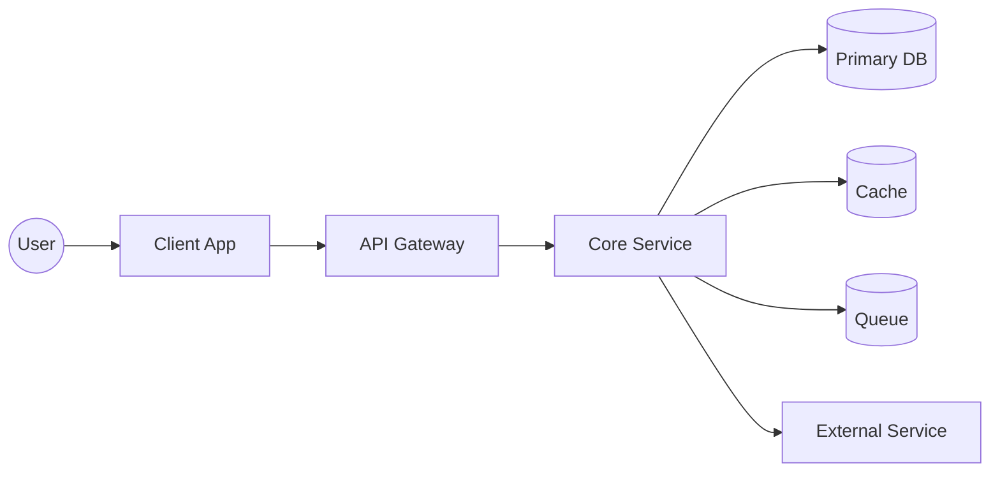
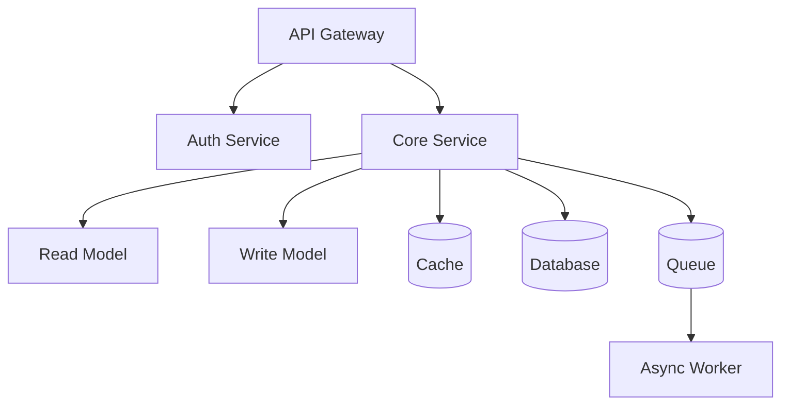
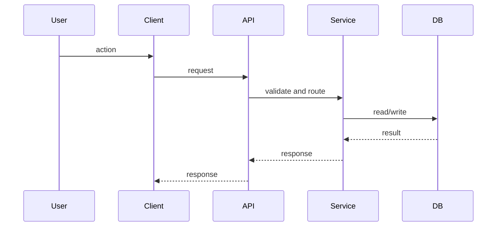
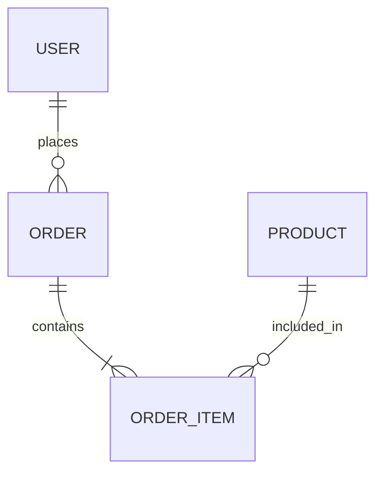
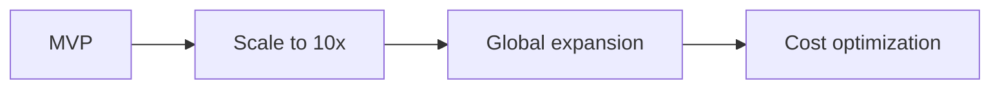

# HelloInterview HLD Learning Workflow

This workflow is for practicing each HelloInterview high level design (HLD) problem in a consistent, repeatable way.

## Inputs
- Problem statement from HelloInterview
- Your assumptions and constraints for scale
- Pattern library (your notes of common patterns and solutions)

## Per-Problem Workflow
1. Read the prompt once without solving. Summarize the core goal in one sentence.
2. Clarify scope. List in-scope features and out-of-scope features.
3. Write assumptions. Include target users, traffic, data volume, latency, availability, and compliance.
4. Identify the primary use cases. Limit to 3 to 5 critical flows.
5. Break requirements into functional requirements and non functional requirements.
6. Run pattern recognition for features. Tag each feature with likely patterns.
7. Map each requirement to candidate patterns. Note 1 to 3 patterns per requirement.
7. Define the system boundary. Specify clients, external services, and trust boundaries.
8. Draft the API surface. List the main endpoints or RPC calls and request/response shapes.
9. Define the data model. List key entities, fields, and relationships.
10. Choose storage and data access. Explain why SQL, NoSQL, or hybrid fits each entity.
11. Create the high level architecture. List components and responsibilities.
12. Design the data flows for the top use cases. Use a step-by-step narrative.
13. Add scalability strategies. Caching, sharding, queues, batching, and async workflows.
14. Add reliability strategies. Replication, failover, retries, idempotency, and backpressure.
15. Add consistency and ordering choices. State the tradeoffs and why.
16. Add security and privacy. AuthN, AuthZ, encryption, audit, and rate limits.
17. Run a bottleneck review. Identify the top 3 risks and mitigations.
18. List alternatives and tradeoffs. Provide at least 2 alternatives.
19. Summarize all approaches. Provide a short comparison table.
20. Summarize the final design in 5 to 8 bullets.
21. Create a mini quiz with answers. 5 to 10 questions that test the design.

## Deliverables
- A one page summary
- A full design doc
- A diagram set
- A quiz with answers

## Design Doc Template
1. Problem summary
2. Scope and assumptions
3. Requirements
4. API surface
5. Data model
6. High level architecture
7. Core flows
8. Scalability and performance
9. Reliability and failure handling
10. Consistency and data integrity
11. Security and privacy
12. Alternatives and tradeoffs
13. Open questions

## Diagram Set
- Context diagram
- Component diagram
- Sequence diagram for the primary flow
- Data model diagram
- Roadmap diagram

## Pattern Recognition Cheat Sheet
Use this to tag features and map to likely patterns quickly.
- Feed or timeline: fanout, materialized views, caching, pagination
- Search: inverted index, ETL, async indexing, query caching
- Notifications: event bus, outbox pattern, fanout, rate limiting
- File upload or media: object storage, CDN, async processing, transcoding pipeline
- Payments or ledger: double entry ledger, idempotency, reconciliation, audit trail
- Real time updates: pub sub, WebSockets, SSE, backpressure
- Recommendations: offline batch, online serving, feature store, A/B testing
- Analytics: event tracking, data lake, batch aggregation, OLAP store
- High write volume: sharding, append only logs, partitioning
- High read volume: caching, read replicas, materialized views

## Summary of Approaches Template
Use this after exploring alternatives.
- Approach A: core idea, best for, tradeoffs
- Approach B: core idea, best for, tradeoffs
- Approach C: core idea, best for, tradeoffs

Comparison Table:
| Approach | Scale | Complexity | Cost | Latency | Consistency | Pros | Cons | Patterns |
|---|---|---|---|---|---|---|---|---|
| A |  |  |  |  |  |  |  |  |
| B |  |  |  |  |  |  |  |  |
| C |  |  |  |  |  |  |  |  |

## Mermaid Diagram Templates
Use these templates as starting points and fill in system specific details.

Context diagram:

Component diagram:

Sequence diagram:

Data model diagram:

Roadmap diagram:

## Cognitive Learning Additions
Add these to improve retention and recall.
- Retrieval practice checkpoints: after Requirements, Architecture, and Tradeoffs, answer 3 quick recall prompts.
- Spaced repetition schedule: Day 1 review summary and quiz, Day 3 re-explain architecture, Day 7 redraw from memory, Day 14 do a timed mini redo.
- Error log: record mistakes, wrong assumptions, and corrected reasoning.
- Teach-back summary: 60 second explanation as if teaching a junior engineer.
- Variant drill: re-evaluate with a changed constraint (latency, write-heavy, geo, privacy).
- Constraints-first warmup: 3 minute list of likely bottlenecks before designing.
- Pattern flashcards: 1 to 2 cards per pattern used, with when-to-use and when-not-to-use.
- Mental model sketch: one page system-at-a-glance drawing, then redraw from memory later.
- Timeboxing: set target minutes per phase to avoid drift.
- Scoring rubric: rate clarity, tradeoffs, risks, and completeness from 1 to 5.

## Cognitive Checklist Template
- Retrieval prompts answered
- Spaced review scheduled
- Error log updated
- Teach-back recorded
- Variant drill done
- Bottlenecks listed first
- Flashcards created
- Mental model redrawn
- Timeboxes followed
- Self-score recorded

## Review Checklist
- Requirements are explicit and measurable
- Assumptions are stated with numbers
- Each requirement maps to a pattern or design choice
- Data model supports the core flows
- Architecture addresses scale and reliability
- Tradeoffs are acknowledged
- Risks are identified and mitigations listed

## Study Loop
1. Do the full workflow for a new problem.
2. The next day, re-read the one page summary and quiz yourself.
3. One week later, redraw the architecture from memory and compare.
4. After 5 problems, update the pattern library with new insights.
