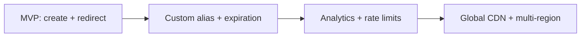
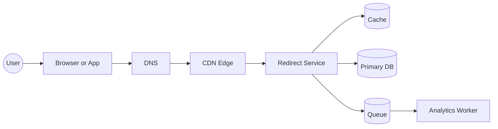
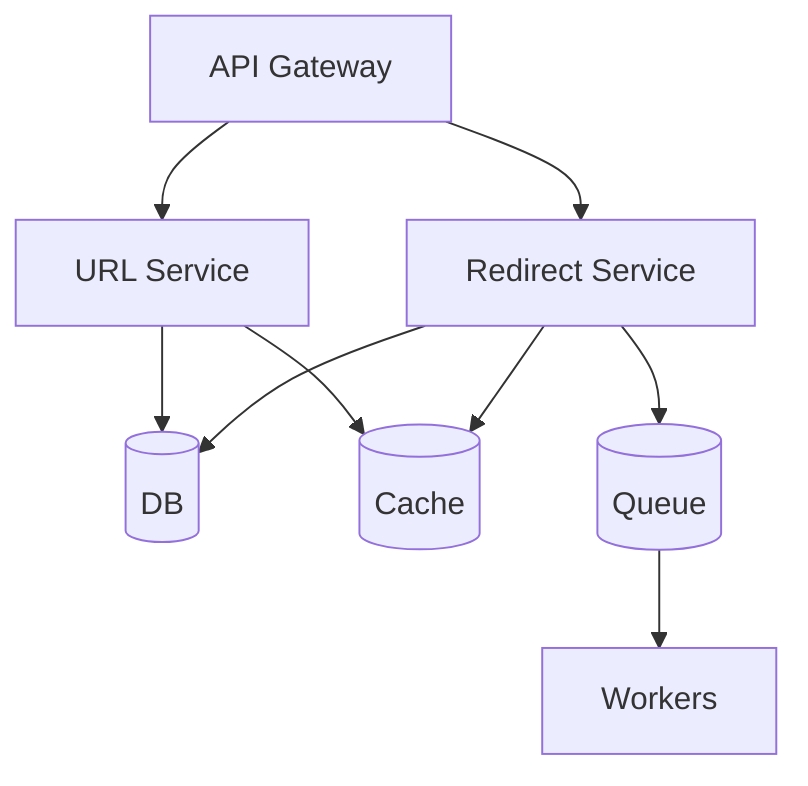
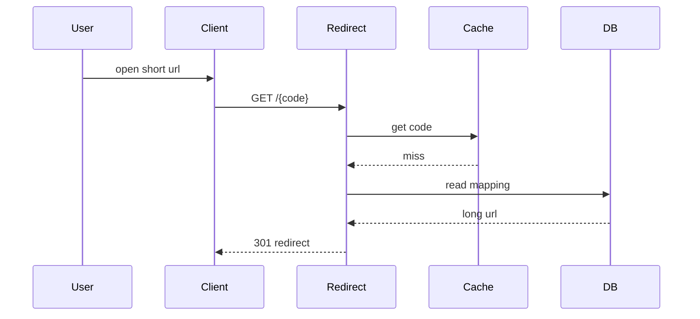
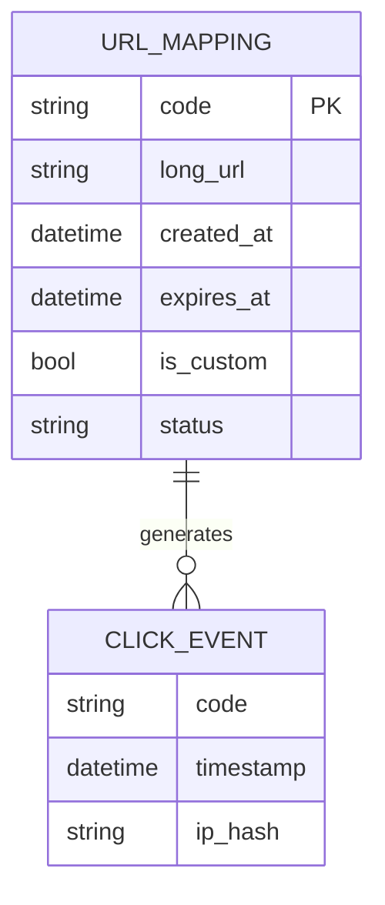

# Tiny URL HLD (HelloInterview Problem 1)

## Problem Summary
Design a URL shortening service that creates short links and redirects users to the original long URLs with low latency and high availability.

## Scope and Assumptions
- In scope: create short URL, redirect, optional custom alias, basic analytics (click count), expiration.
- Out of scope: advanced analytics, user accounts, abuse detection (not designed, only noted).
- Scale assumptions:
- 50M new URLs per month.
- 1B redirects per month.
- Read heavy: 20x more redirects than writes.
- p95 redirect latency under 50 ms.
- Availability 99.9% for redirect.
- Data retention 3 years for non-expiring links.

## Requirements
Functional:
- Create a short URL for a long URL.
- Redirect short URL to long URL.
- Support optional custom alias.
- Support optional expiration time.
- Basic click count.

Non functional:
- Low latency redirect.
- High availability for redirects.
- Scale read-heavy traffic.
- Prevent collisions.
- Consistent redirects even during failures.

## Pattern Recognition (Feature to Pattern)
- URL creation: key generation, uniqueness, idempotency.
- Redirect: cache aside, read replicas, CDN edge caching.
- Custom alias: uniqueness constraint, reserved namespace.
- Expiration: TTL, background cleanup, soft delete.
- Click count: async eventing, eventual consistency.

## System Boundary
- Clients: web browsers, mobile apps, bots.
- Core services: API, redirect service, key generator.
- Storage: primary DB, cache.
- Async: queue + worker for analytics and cleanup.
- External: DNS, CDN.

## API Surface
Create short URL:
```
POST /v1/urls
{
  "long_url": "https://example.com/a/very/long/path",
  "custom_alias": "myalias",
  "expires_at": "2026-12-31T00:00:00Z"
}
```
Response:
```
{
  "short_url": "https://t.ly/abc123",
  "code": "abc123",
  "expires_at": "2026-12-31T00:00:00Z"
}
```

Redirect:
```
GET /{code}
```
Response: HTTP 301 to long URL.

## Data Model
Entity: UrlMapping
- code (PK)
- long_url
- created_at
- expires_at (nullable)
- is_custom (bool)
- owner_id (optional)
- status (active, expired, deleted)

Entity: ClickEvent (optional analytics)
- code
- timestamp
- user_agent
- referrer
- ip_hash

## High Level Architecture
- API Gateway routes /v1/urls to URL Service.
- URL Service validates input, creates code, writes to DB, warms cache.
- Redirect Service handles GET /{code}, reads cache, falls back to DB.
- Cache for hot mappings.
- Queue for click events and cleanup.
- Analytics Worker increments counters and aggregates.
- Cleanup Worker deletes expired mappings.

## Core Flows
Create:
1. Client calls POST /v1/urls with long_url.
2. URL Service validates, checks custom alias if provided.
3. Generate unique code if not custom.
4. Write UrlMapping to DB.
5. Write cache entry.
6. Return short URL.

Redirect:
1. Client hits GET /{code}.
2. Redirect Service checks cache.
3. If cache miss, read DB and update cache.
4. If expired or missing, return 404.
5. Return 301 to long URL.
6. Emit click event to queue asynchronously.

## Scalability and Performance
- Cache aside for hot mappings.
- Read replicas for DB.
- CDN edge caching for popular redirects.
- Partition DB by code prefix.
- Batch analytics updates to reduce write load.

## Reliability and Failure Handling
- Multi-AZ DB with replication.
- Cache failures fall back to DB.
- Queue backpressure with retry and DLQ.
- Idempotent create using request_id for retries.

## Consistency and Data Integrity
- Strong consistency for mapping creation.
- Eventual consistency for click counts.
- Custom alias uniqueness enforced at DB.

## Security and Privacy
- Validate URL format and scheme.
- Rate limit create and redirect endpoints.
- Protect reserved aliases.
- Store IP as hash for privacy.

## Alternatives and Tradeoffs
Approach A: Random code with DB uniqueness check.
- Pros: simple, low coupling.
- Cons: retries on collisions.

Approach B: Base62 of auto-increment ID.
- Pros: fast, deterministic.
- Cons: hot shard, predictable IDs.

Approach C: Distributed ID generator (Snowflake-like).
- Pros: scalable, unique without DB round trip.
- Cons: higher complexity, clock issues.

## Summary of Approaches
Comparison Table:
| Approach | Scale | Complexity | Cost | Latency | Consistency | Pros | Cons | Patterns |
|---|---|---|---|---|---|---|---|---|
| Random + DB check | High | Low | Low | Medium | Strong | Simple | Collisions | Key gen, unique constraint |
| Base62 auto-id | Medium | Low | Low | Low | Strong | Fast create | Predictable IDs | Sequence IDs |
| Distributed ID | Very high | Medium | Medium | Low | Strong | No collisions | Ops complexity | ID generator |

## Final Design Summary
- Cache aside + DB for mappings, read-heavy optimized.
- Random code with uniqueness check for simplicity.
- CDN and cache for hot redirects.
- Async click events for analytics.
- TTL for expiration with cleanup worker.

## Roadmap


## Diagram Set
Context diagram:


Component diagram:


Sequence diagram:


Data model diagram:


## Review Checklist
- Requirements are explicit and measurable.
- Assumptions are stated with numbers.
- Each requirement maps to a pattern or design choice.
- Data model supports the core flows.
- Architecture addresses scale and reliability.
- Tradeoffs are acknowledged.
- Risks are identified and mitigations listed.

## Mini Quiz With Answers
1. Why use cache aside for redirects?
- To minimize DB reads for hot keys while preserving correctness on misses.
2. Why is click counting eventually consistent?
- To avoid adding latency to redirects and reduce write load.
3. What is the risk of Base62 auto-id?
- Predictable IDs and potential hot shard.
4. How do you handle custom alias collisions?
- Enforce uniqueness in DB and return conflict if taken.
5. What is the fallback when cache is down?
- Read from DB and continue redirects.

## Cognitive Learning Additions
Retrieval prompts:
- List the core flows and their data stores.
- Explain why the chosen ID strategy fits the scale.
- Name two major bottlenecks and mitigations.

Spaced repetition schedule:
- Day 1: review summary and quiz.
- Day 3: re-explain architecture from memory.
- Day 7: redraw all diagrams.
- Day 14: do a timed mini redo in 25 minutes.

Error log:
- Mistake:
- Fix:
- Lesson:

Teach-back summary:
- 60 second explanation script:

Variant drill:
- Change: 10x write volume.
- Adjustments:

Constraints-first warmup:
- Likely bottlenecks:

Pattern flashcards:
- Pattern:
- When to use:
- When not to use:

Mental model sketch:
- Redraw later from memory.

Timeboxing:
| Phase | Target Minutes |
|---|---|
| Requirements | 5 |
| Architecture | 10 |
| Data model | 5 |
| Tradeoffs | 5 |
| Diagrams | 10 |
| Review + quiz | 5 |

Scoring rubric:
| Dimension | Score 1-5 | Notes |
|---|---|---|
| Clarity |  |  |
| Tradeoffs |  |  |
| Risks |  |  |
| Completeness |  |  |
